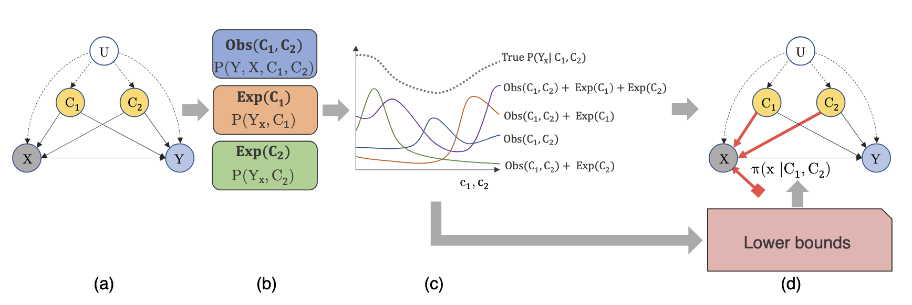
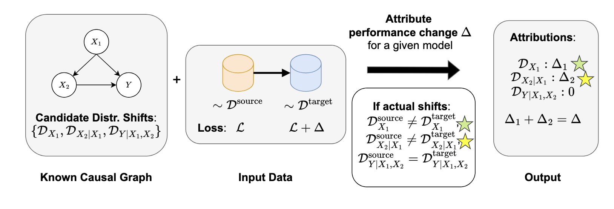
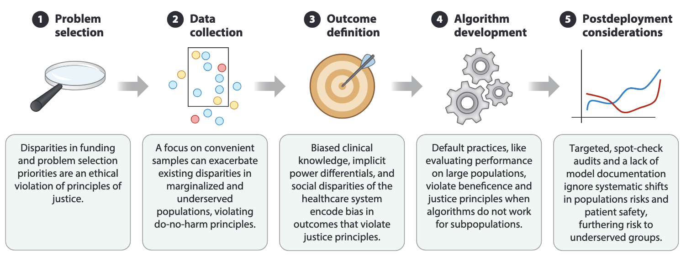

Please refer to Dr. Joshi's <a href="https://scholar.google.com/citations?hl=en&user=x5wW5WIAAAAJ&view_op=list_works&sortby=pubdate" target="_blank">Google Scholar page</a> for an updated list of publications. 

**Navy text** denotes reAIM authors.

<h3>Selected Publications</h3>

  
  

    <a href="https://ojs.aaai.org/index.php/AAAI/article/view/29198" target="_blank"><strong>Towards Safe Policy Learning Under Partial Identifiability: A Causal Approach</strong></a> 
    <strong>Shalmali Joshi, Junzhe Zhang, and Elias Bareinboim.</strong> 
    <i>AAAI Conference on Artificial Intelligence (AAAI) 2024</i> 
  

  
  

    <a href="https://proceedings.mlr.press/v202/zhang23ai/zhang23ai.pdf" target="_blank"><strong>"Why did the Model Fail?": Attributing Model Performance Changes to Distribution Shifts</strong></a> 
    <strong>Haoran Zhang, Harvineet Singh, Marzyeh Ghassemi, and Shalmali Joshi</strong> 
    <i>International Conference on Machine Learning  (ICML) 2023</i> 
  

  
  

    <a href="https://www.annualreviews.org/content/journals/10.1146/annurev-biodatasci-092820-114757" target="_blank"><strong>Ethical Machine Learning in Healthcare</strong></a> 
    <strong>Irene Y. Chen, Emma Pierson, Sherri Rose, Shalmali Joshi, Kadija Ferryman, and Marzyeh Ghassemi</strong> 
    <i>Annual Review of Biomedical Data Science, 2021</i> 
  

<h3>Preprints</h3>

<!-- 

  

    <a href="https://link-to-publication3.com" target="_blank">
      <strong>Title of Publication 3</strong>
    </a> 
    <strong>Authors of Publication 3</strong> 
    <i>Journal of Publication 3</i> 
  

 -->

  

    <a href="https://www.medrxiv.org/content/10.1101/2024.07.05.24310013v1" target="_blank">
      <strong>Machine Learning is More Accurate and Biased than Risk Scoring Tools in the Prediction of Postoperative Atrial Fibrillation After Cardiac Surgery</strong>
    </a> 
    <strong>Joyce C. Ho, Shalmali Joshi, Eduardo Valverde, Kathryn Wood, Kendra J. Grubb, Miguel A. Leal, and Vicki Stover Hertzberg</strong> 
    <i>medRxiv preprint</i> 
  

<h3>2024</h3>

  

    <a href="https://www.nature.com/articles/s41537-024-00490-0" target="_blank">
      <strong>Prevalence and Incidence Measures for Schizophrenia Among Commercial Health Insurance and Medicaid Enrollees</strong>
    </a> 
    <strong>Molly T. Finnerty, Atif Khan, Kai You, Rui Wang, Gyojeong Gu, Deborah Layman, Qingxian Chen, Noémie Elhadad, 
    Shalmali Joshi, Paul S. Appelbaum, Todd Lencz, Sander Markx, Steven A. Kushner and Andrey Rzhetsky</strong> 
    <i>Schizophrenia, 2024</i> 
  

  

    <a href="https://ojs.aaai.org/index.php/AAAI/article/view/29198" target="_blank">
      <strong>Towards Safe Policy Learning Under Partial Identifiability: A Causal Approach</strong>
    </a> 
    <strong>Shalmali Joshi, Junzhe Zhang, and Elias Bareinboim</strong> 
    <i>AAAI Conference on Artificial Intelligence (AAAI) 2024</i> 
  

  

    <a href="https://academic.oup.com/rheumatology/article/63/9/2319/7665716" target="_blank">
      <strong>Rise of the Machines: How Machine Learning Will Shape the Field of Rheumatology</strong>
    </a> 
    <strong>Shalmali Joshi, and Jason E. Liebowitz</strong> 
    <i>Rheumatology, 2024</i> 
  

  

    <a href="https://openreview.net/pdf?id=sMiSQP8zmr" target="_blank">
      <strong>Does Multimodality Help in Deep Learning-Based Structural Heart Disease Detection?</strong>
    </a> 
    <strong>Young Sang Choi, Shalmali Joshi, Linyuan Jing, and Pierre Elias</strong> 
    <i>Medical Imaging with Deep Learning (MIDL) 2024 (Short Paper Track)</i> 
  

<h3>2023</h3>

  

    <a href="https://proceedings.mlr.press/v202/zhang23ai/zhang23ai.pdf" target="_blank">
      <strong>"Why Did the Model Fail?": Attributing Model Performance Changes to Distribution Shifts</strong>
    </a> 
    <strong>Haoran Zhang, Harvineet Singh, Marzyeh Ghassemi, and Shalmali Joshi</strong> 
    <i>International Conference on Machine Learning (ICML) 2023</i> 
  

  

    <a href="https://www.cell.com/patterns/pdf/S2666-3899(23)00248-9.pdf" target="_blank">
      <strong>A Normative Framework for Artificial Intelligence as a Sociotechnical System in Healthcare</strong>
    </a> 
    <strong>Melissa D. McCradden, Shalmali Joshi, James A. Anderson, and Alex John London</strong> 
    <i>Patterns, 2023</i> 
  

  

    <a href="https://dl.acm.org/doi/pdf/10.1145/3593013.3594096" target="_blank">
      <strong>What's Fair Is… Fair?: Presenting JustEFAB, an Ethical Framework for Operationalizing Medical Ethics and Social Justice in the Integration of Clinical Machine Learning: JustEFAB</strong>
    </a> 
    <strong>Melissa McCradden, Oluwadara Odusi, Shalmali Joshi, Ismail Akrout, Kagiso Ndlovu, Ben Glocker, Gabriel Maicas et al.</strong> 
    <i>ACM Conference on Fairness, Accountability, and Transparency (FAccT) 2023</i> 
  

